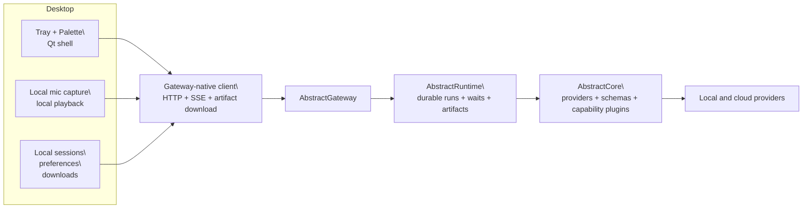

# Architecture

AbstractAssistant is a gateway-native desktop shell. The assistant owns tray and palette UX,
session-oriented local convenience state, microphone capture, playback, and artifact opening. The
gateway owns workflows, durable execution, multimodal capability defaults, media routing, and
provider access.

See also:

- [getting-started.md](getting-started.md)
- [api.md](api.md)
- [adr/README.md](adr/README.md)

## High-Level Diagram

## Source Of Truth

Gateway is authoritative for:

- workflow catalog and default entrypoints
- provider/model defaults for multimodal routes
- durable run state, history bundles, ledger streaming, and waits
- direct image, video, voice, sound, and music execution

The assistant is authoritative only for:

- local tray and palette preferences
- local session continuity for the desktop experience
- downloaded artifact cache
- local mic capture and local audio playback

## Desktop Shell

The Qt tray shell lives in `abstractassistantv2/` and provides:

- a compact top-right palette
- one canonical assistant workflow from the gateway tenant catalog
- durable gateway sign-in state for bearer-token or hosted user-session deployments
- a gateway capability-default editor
- workflow-routed tool and media requests
- optional global hotkey support when the platform/runtime allows it

## Published Workflow

The assistant uses the published gateway workflow bundle `abstractassistant-orchestrator`.

Launch flow:

1. Reconcile the managed `abstractassistant-orchestrator` workflow when needed.
2. Read the gateway tenant catalog and resolve the published assistant workflow entrypoint.
3. Start a run through `/api/gateway/runs/start`.
4. Replay history and follow ledger SSE.
5. Surface waits locally and resume them through gateway commands.

The assistant does not use private bundle execution, sandbox chat, or client-side direct media
execution.

## Capability Defaults

The assistant does not treat local provider/model choices as the default routing policy.

Instead:

- the Settings dialog edits gateway capability-default routes
- the desktop client keeps only local UI preferences durable
- the published assistant workflow consumes the configured gateway routes for chat, tools, voice,
  image, video, sound, and music behavior

For newer multimodal route features, the assistant intentionally stays a thin
client:

- Gateway/Core own task compatibility, model compatibility, adapter
  compatibility, and request validation.
- The assistant owns only the local shell and passes advanced route options through unchanged.
- Typed provider/model selectors remain in the Settings UI, while advanced
  route-specific fields such as `count`, `seeds`, `lora_adapters`,
  `guidance_2`, and `flow_shift` live in the bounded `options` JSON
  surface.

This boundary is documented in [ADR 0001](adr/0001_gateway_native_assistant_v2.md).

## Voice Boundary

Voice responsibilities are split intentionally:

- desktop: microphone capture, VAD, playback, pause/resume, meter rendering
- gateway: STT, TTS, and provider/model resolution

If gateway voice routes are unavailable, the assistant disables the voice controls rather than
silently loading a local speech model.

## Gateway Auth Boundary

The desktop assistant supports both gateway bearer tokens and hosted gateway user sessions.
Bearer tokens remain useful for local and operator-controlled setups. Hosted user-session mode
exchanges a gateway user token for an opaque gateway session plus CSRF token and stores only that
session state locally for later reconnects.

## Validation

The repository validates the gateway-native shell through:

- `abstractassistant/tests/basic`
- `abstractassistant/tests/integration`
