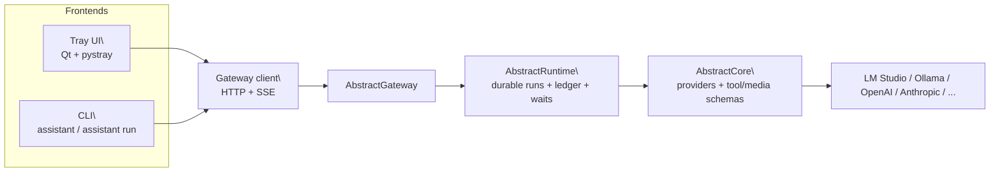

# Architecture

AbstractAssistant is a gateway-first thin client. It renders tray/CLI UX locally, but workflow execution, provider access, and durable run state live in AbstractGateway.

See also:
- [README.md](README.md)
- [getting-started.md](getting-started.md)
- [api.md](api.md)

## High-level diagram



## Responsibilities

- AbstractAssistant:
  - connects to the gateway
  - renders providers/models/workflows discovered from the gateway
  - persists only local session UI state, cached selections, and downloaded artifacts
  - surfaces approval and ask-user waits, then resumes them through gateway commands

- AbstractGateway:
  - loads workflow bundles
  - exposes workflow/provider/model/tool discovery
  - starts and resumes durable runs
  - talks to providers through AbstractCore

## Workflow discovery

AbstractAssistant does not ship or choose workflow bundles itself.

Workflow availability comes from `GET /api/gateway/bundles`. For local development, the gateway must be started with a bundle directory such as:

```bash
export ABSTRACTGATEWAY_FLOWS_DIR="$PWD/abstractgateway/flows/bundles"
```

If the gateway exposes no `abstractcode.agent.v1` entrypoints, the assistant cannot start a run.

## Session state

Local state is stored under `~/.abstractassistant/` and is limited to client-side concerns:
- session transcript snapshots
- last selected provider/model/workflow per session
- last seen run id
- downloaded artifacts and local UI cache

The durability source of truth for execution remains the gateway ledger and run stores.

## Entry points

- `assistant`
- `abstractassistant`
- `assistant run --prompt "..."`

Optional assistant-side overrides:
- `--gateway-url`
- `--gateway-token`

## Tool approval path

Tool execution is gateway-driven and wait-based:
1. a workflow emits a tool-approval wait on the gateway
2. AbstractAssistant shows the approval UI
3. AbstractAssistant submits a durable `resume` command
4. the gateway continues the run

The assistant never bypasses gateway durability for tool execution.
