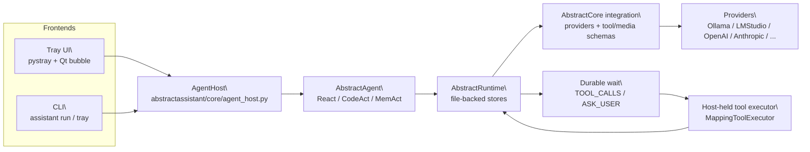

# Architecture

AbstractAssistant is a local **agent host**: it exposes a tray UI and a CLI and runs
**AbstractAgent + AbstractRuntime locally**, using **AbstractCore** for provider/tool/media schemas.

See also:
- [README.md](README.md) (docs hub)
- [api.md](api.md) (CLI + programmatic API)
- [getting-started.md](getting-started.md) (user guide)

## High-level diagram



## Goals

- One-click access (tray) to a capable agent.
- Durable execution (runs survive restarts; waits are explicit).
- Safe tool execution: tools are never persisted as callables in run state; the host executes them only after approval.
- Optional voice (STT/TTS) at runtime (voice dependencies are included in the default install).

## What “durable tool execution” means here

Durability requires that tool calls are:
1) written to durable state as **JSON tool-call specs** (name + arguments),
2) surfaced as a **durable wait** (`TOOL_CALLS`),
3) executed by a host-held executor **outside** of the provider call,
4) and then resumed into the runtime with **JSON tool results**.

AbstractAssistant follows this rule. It **does not** use AbstractCore’s legacy provider-side tool execution (`execute_tools=True`, deprecated).

## Core modules

### Agent host (backend)

`abstractassistant/core/agent_host.py` is the main backend. It:
- creates a local runtime with file-backed stores (runs + ledger + artifacts)
- constructs an agent (`ReactAgent`, `CodeActAgent`, or `MemActAgent`)
- drives the agent tick loop until terminal state
- handles waits:
  - TOOL_CALLS waits: emits a `tool_request` event, executes approved tools via a host-held executor, then resumes the run
  - ASK_USER waits: emits an `ask_user` event and resumes with user input

Events are plain dicts intended to be consumed by any UI:
- `status` (`thinking`, `executing_tools`, `ready`, …)
- `tool_request` / `tool_result`
- `ask_user`
- `assistant` (final answer)
- `error`

### Runtime wiring (local, file-backed)

`AgentHost` builds a local runtime via `abstractruntime.integrations.abstractcore.create_local_runtime(...)` with file-backed stores:
- Run store (`JsonFileRunStore`)
- Ledger store (`JsonlLedgerStore`)
- Artifact store (`FileArtifactStore`)

The runtime is configured with:
- `PassthroughToolExecutor(mode="approval_required")` so `TOOL_CALLS` produces a **durable wait**.
- A host-held `MappingToolExecutor.from_tools(...)` that executes approved tool calls and returns tool results.

### Session snapshot (fast UI state)

`abstractassistant/core/session_store.py` persists a small `session.json` snapshot:
- `session_id` / `actor_id`
- transcript messages
- `last_run_id`

This is a UX optimization only: the runtime stores remain the durability source of truth.

### Tool approval policy

`abstractassistant/core/tool_policy.py` defines the default “safe auto-approve” vs “requires approval” sets. UIs can:
- auto-approve safe/read-only batches,
- prompt for approval on destructive/unknown batches,
- optionally maintain a session-scoped allowlist.

## Durability model

By default, state is stored under `~/.abstractassistant/`.

Notes:
- Both `assistant` and `abstractassistant` accept `--data-dir` (as a global flag, before the subcommand).
  - `assistant --data-dir ~/.abstractassistant tray`
  - `assistant --data-dir ~/.abstractassistant run --prompt "Hello"`
- Default remains `~/.abstractassistant/`.

```
~/.abstractassistant/
  sessions.json
  session.json
  runtime/
    *.json   (run store)
    *.jsonl  (ledger)
    ...      (artifacts)
  sessions/
    <session_id>/
      session.json
      runtime/
        *.json
        *.jsonl
        ...
```

Durability is provided by AbstractRuntime:
- every run has a durable state machine (`RUNNING` → `WAITING` → `COMPLETED`/`FAILED`)
- waits are explicit (`TOOL_CALLS`, `ASK_USER`, …) and resumable
- a ledger records effect execution for replay/observability

## Tool execution boundary

AbstractAssistant follows the framework’s “durable tool execution” rule:

- The runtime is configured with a `PassthroughToolExecutor(mode="approval_required")`.
  - Result: a TOOL_CALLS effect produces a durable wait that contains only JSON tool-call specs.
- The host holds the real callables via `MappingToolExecutor.from_tools(...)`.
- After approval, the host executes the tool batch and resumes the run with tool results:
  - `Runtime.resume(workflow=..., run_id=..., wait_key=..., payload=tool_results)`

This ensures:
- no Python callables end up persisted in `RunState.vars`
- pending tool work can be resumed after restarts
- the UI can always show “what is about to happen” before it happens

### Why you might see “tool execution disabled” logs

AbstractCore providers have a legacy mode where the **provider** executes tools (`execute_tools=True`, deprecated). In agentic/runtime hosts (AbstractAssistant), provider-side tool execution is intentionally disabled:
- the provider still receives tool *schemas* (so the model can emit tool calls),
- but it returns tool calls without executing them,
- and the runtime/host executes them durably (as described above).

So “tool execution disabled” refers to **provider-side** tool execution, not “tools are off”.

## UI integration (Qt/tray)

The tray UI uses a worker thread to keep Qt responsive:
- `abstractassistant/ui/qt_bubble.py` uses `AgentWorker` (a `QThread`) to drive `AgentHost.run_turn(...)`
- tool approvals are handled on the main thread via a modal approval dialog
- ASK_USER waits are handled via a simple input prompt

## Voice integration

Voice features are included in the default install (`pip install abstractassistant`):
- `abstractassistant/core/tts_manager.py` wraps `abstractvoice.VoiceManager`
- the tray UI can run:
  - TTS for assistant outputs
  - Full Voice Mode: STT transcriptions routed into the same agentic send pipeline

Voice is still optional at runtime: users can keep it off, and `assistant --help` / headless usage should avoid importing GUI/audio stacks for fast startup.

## Entry points

- CLI: `abstractassistant/cli.py`
  - `assistant tray`
  - `assistant run --prompt ...` (interactive tool approvals in terminal)
- Tray app: `abstractassistant/app.py` (pystray + Qt)

## Ecosystem positioning

AbstractAssistant is part of the **AbstractFramework** ecosystem:
- https://github.com/lpalbou/AbstractFramework
- core components used directly in this repo:
  - **AbstractCore**: https://github.com/lpalbou/abstractcore
  - **AbstractRuntime**: https://github.com/lpalbou/abstractruntime

## Notes / current boundaries

- The tray UI currently drives `ReactAgent` via `abstractassistant/core/llm_manager.py`.
- CLI can select `--agent react|codeact|memact` (see `abstractassistant/cli.py`).

## Install

`pip install abstractassistant` installs the tray UI plus voice/media/provider/tool integrations by default.

## Comparison: AbstractAssistant vs AbstractCode Web (thin client)

AbstractAssistant is a **local host** (runs agent + runtime locally).
AbstractCode Web is a **gateway-first thin client** (browser UI only) in the AbstractFramework repository:
https://github.com/lpalbou/AbstractFramework (see `abstractcode/web/` there).

| Concern | AbstractAssistant (this repo) | AbstractCode Web (in AbstractFramework) |
|---|---|---|
| Agent execution | Local process (`abstractagent`) | Remote (behind `abstractgateway`) |
| Runtime execution | Local (`abstractruntime`, file-backed stores) | Remote (gateway exposes run APIs + ledger) |
| Tool execution | Local host executes tools after a durable `TOOL_CALLS` wait | Browser does not execute tools; it submits approvals/commands to gateway |
| Durability location | Local disk (`~/.abstractassistant/runtime/`) | Gateway stores (server-side) |
| UI rendering | Events from `AgentHost.run_turn(...)` | Ledger replay/stream (SSE) from gateway |
| Offline/local-model | Possible (e.g. LMStudio/Ollama) | Not by itself; requires gateway connectivity |

Code references:
- AbstractAssistant local host: `abstractassistant/core/agent_host.py`
- AbstractCode Web thin client:
  - repository: https://github.com/lpalbou/AbstractFramework
