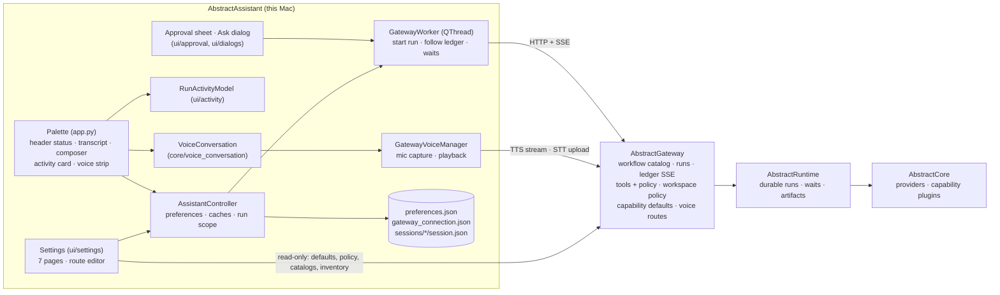
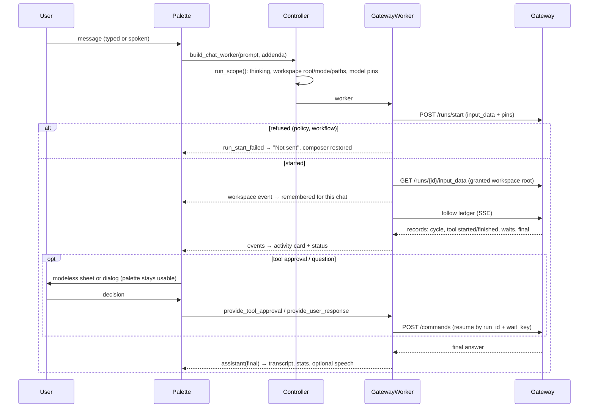

# Architecture

AbstractAssistant is a gateway-native desktop shell. The assistant owns the tray and palette,
local preferences, session continuity, microphone capture, playback and artifact opening. The
gateway owns workflows, durable execution, provider access, tool execution, workspace policy and
multimodal defaults.

See also:

- [getting-started.md](getting-started.md)
- [settings.md](settings.md) — every setting, its source and its storage
- [voice.md](voice.md) — speech features and the conversation loop
- [api.md](api.md)
- [adr/README.md](adr/README.md)

## Components

```mermaid
flowchart LR
  subgraph Desktop["AbstractAssistant (this Mac)"]
    Palette["Palette (app.py)\nheader status · transcript · composer\nactivity card · voice strip"]
    Settings["Settings (ui/settings)\n7 pages · route editor"]
    Sheets["Approval sheet · Ask dialog\n(ui/approval, ui/dialogs)"]
    Activity["RunActivityModel (ui/activity)"]
    Voice["VoiceConversation\n(core/voice_conversation)"]
    Controller["AssistantController\npreferences · caches · run scope"]
    Worker["GatewayWorker (QThread)\nstart run · follow ledger · waits"]
    VoiceMgr["GatewayVoiceManager\nmic capture · playback"]
    Prefs[("preferences.json\ngateway_connection.json\nsessions/*/session.json")]
  end
  Gateway["AbstractGateway\nworkflow catalog · runs · ledger SSE\ntools + policy · workspace policy\ncapability defaults · voice routes"]
  Runtime["AbstractRuntime\ndurable runs · waits · artifacts"]
  Core["AbstractCore\nproviders · capability plugins"]

  Palette --> Controller
  Settings --> Controller
  Sheets --> Worker
  Palette --> Activity
  Palette --> Voice
  Voice --> VoiceMgr
  Controller --> Prefs
  Controller --> Worker
  Worker -- "HTTP + SSE" --> Gateway
  VoiceMgr -- "TTS stream · STT upload" --> Gateway
  Settings -- "read-only: defaults, policy, catalogs, inventory" --> Gateway
  Gateway --> Runtime --> Core
```

## Source of truth

The gateway is authoritative for:

- the workflow catalog and the published `abstractassistant-orchestrator` workflow
- provider and model defaults for every capability route
- tool inventory, tool risk classification and approval defaults
- workspace policy (what a run may touch on the gateway host)
- durable run state, history, ledger streaming, waits and artifacts
- speech-to-text and text-to-speech execution

The assistant is authoritative only for local state under `~/.abstractassistant/`:

- `preferences.json` — local overrides sent per request (model routes, reasoning effort,
  workspace grant, voice options, tool modes, hotkey, window size)
- `gateway_connection.json` — gateway URL and sign-in state
- `sessions/` — the transcript snapshot, last run id and granted workspace root of each chat
- downloaded artifacts

Local overrides never write the gateway's shared configuration. Every screen that shows a value
says whether it is the gateway default or this app's override.

## Run lifecycle

```mermaid
sequenceDiagram
  participant U as User
  participant P as Palette
  participant C as Controller
  participant W as GatewayWorker
  participant G as Gateway
  U->>P: message (typed or spoken)
  P->>C: build_chat_worker(prompt, addenda)
  C->>C: run_scope(): thinking, workspace root/mode/paths, model pins
  C->>W: worker
  W->>G: POST /runs/start (input_data + pins)
  alt refused (policy, workflow)
    W-->>P: run_start_failed → "Not sent", composer restored
  else started
    W->>G: GET /runs/{id}/input_data (granted workspace root)
    W-->>P: workspace event → remembered for this chat
    W->>G: follow ledger (SSE)
    G-->>W: records: cycle, tool started/finished, waits, final
    W-->>P: events → activity card + status
    opt tool approval / question
      P->>U: modeless sheet or dialog (palette stays usable)
      U->>P: decision
      P->>W: provide_tool_approval / provide_user_response
      W->>G: POST /commands (resume by run_id + wait_key)
    end
    G-->>W: final answer
    W-->>P: assistant(final) → transcript, stats, optional speech
  end
```

Waits are answered by identity (`run_id` + `wait_key`); a decision deferred with Esc keeps the run
parked and is asked again when the palette is shown or from the activity card. Losing the gateway
mid-run keeps the run busy with a reconnecting status until the follower is back.

## Desktop shell

- `app.py` — the palette window: header (status title, chat picker, actions, connection orb),
  transcript (message cards, banners, live activity card), composer (attachments, dictation,
  voice conversation, prompt, send/stop). It wires events to widgets and owns no gateway logic.
- `controller.py` — preferences and connection stores, gateway service and client, cached
  workflow/tool/policy lookups, run scope, tool policy for a run, run commands (cancel, pause,
  resume, steer).
- `ui/gateway_worker.py` — one thread per run: uploads attachments, starts the run, follows the
  ledger, materializes assistant and tool messages, submits wait answers, folds run statistics.
- `gateway/adapter.py` — ledger records to UI events (`cycle`, `cycle_result`, `tool_started`,
  `tool`, `tool_request`, `ask_user`, `assistant`, `status`).
- `ui/activity.py` — the run activity model (steps, durations, header copy) and the transcript card.
- `ui/approval.py`, `core/tool_presenter.py`, `core/tool_risk.py` — tool approval sheet and
  post-hoc tool cards; presentation of calls and of the gateway's risk classification.
- `ui/settings/` — the settings window (sidebar, pages, extracted route editor).
- `core/voice_conversation.py`, `ui/voice_strip.py`, `core/gateway_voice_manager.py` — the
  hands-free loop, its status strip, and the local capture/playback layer over gateway speech
  routes.
- `ui/styles.py`, `theme.py`, `icons.py` — one token set, one stylesheet builder, the Lucide glyphs.

## Published workflow

The assistant runs one published gateway workflow bundle, `abstractassistant-orchestrator`, from
the tenant catalog. Launch flow:

1. Resolve the published workflow entrypoint from the gateway catalog.
2. Start a run through `/api/gateway/runs/start` with the local pins.
3. Follow the ledger over SSE; surface waits locally and resume them through gateway commands.
4. Persist the final answer and its statistics to the local chat snapshot.

The assistant does not use private bundle execution, sandbox chat, or client-side media
execution ([ADR 0001](adr/0001_gateway_native_assistant_v2.md)).

## Voice boundary

- desktop: microphone capture, voice activity detection, playback, pause/resume, level meter
- gateway: STT, TTS, provider and model resolution

If the gateway does not advertise voice routes, the voice controls are disabled with the reason
rather than falling back to a local speech model. The conversation loop is described in
[voice.md](voice.md).

## Auth boundary

The desktop supports gateway bearer tokens and hosted gateway user sessions. Session mode
exchanges a user token for an opaque session plus CSRF token and stores only that session state
locally.

## Validation

`tests/basic` runs headless (`QT_QPA_PLATFORM=offscreen`) and covers the gateway client and
adapter, run input pins, preferences, the controller, the activity model, the approval sheet and
presenter, the settings pages, the voice conversation loop, and a smoke test that builds the real
palette.
