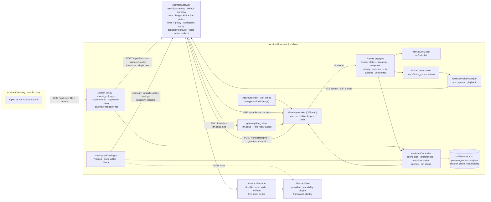
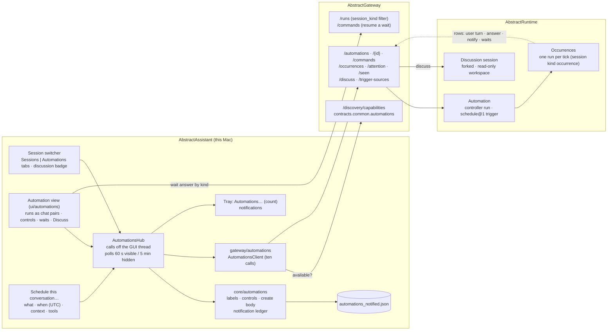
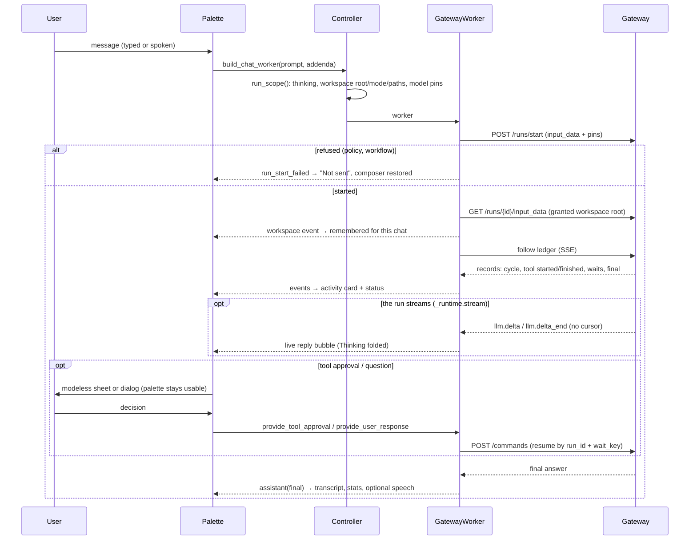
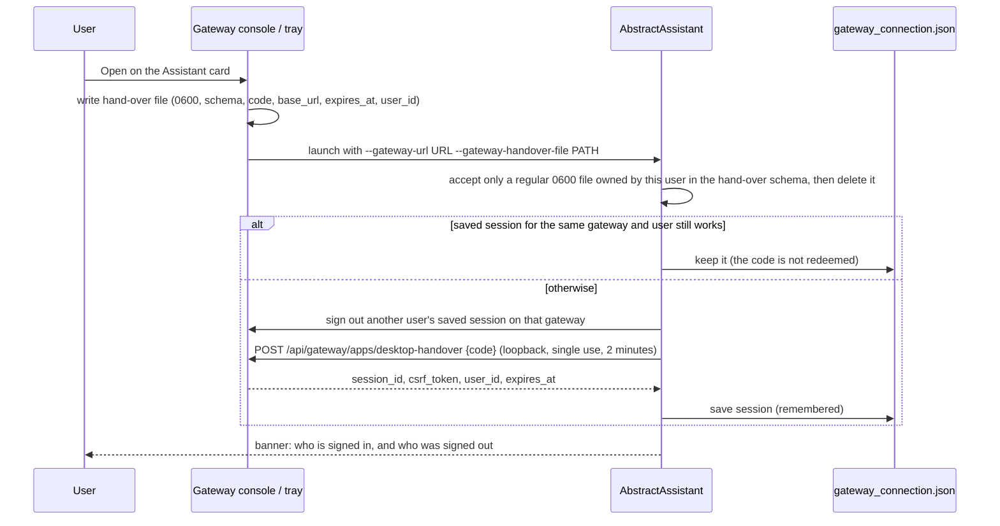

# Architecture

AbstractAssistant is a gateway-native desktop shell. The assistant owns the tray and palette,
local preferences, session continuity, microphone capture, playback and artifact opening. The
gateway owns workflows, durable execution, provider access, tool execution, workspace policy and
multimodal defaults.

See also:

- [getting-started.md](getting-started.md)
- [settings.md](settings.md) — every setting, its source and its storage
- [voice.md](voice.md) — speech features and the conversation loop
- [automations.md](automations.md) — scheduled tasks on the gateway, as the Assistant shows them
- [api.md](api.md)
- [adr/README.md](adr/README.md)

## Components

```mermaid
flowchart LR
  subgraph Console["AbstractGateway console / tray"]
    Open["Open on the Assistant card"]
  end
  subgraph Desktop["AbstractAssistant (this Mac)"]
    Entry["Launch (cli.py · macos_entry.py)\n--gateway-url · --gateway-token\n--gateway-handover-file"]
    Palette["Palette (app.py)\nheader status · transcript · composer\nactivity card · live reply bubbles · voice strip"]
    Settings["Settings (ui/settings)\n7 pages · route editor · About"]
    Sheets["Approval sheet · Ask dialog\n(ui/approval, ui/dialogs)"]
    Activity["RunActivityModel (ui/activity)"]
    Voice["VoiceConversation\n(core/voice_conversation)"]
    Controller["AssistantController\nconnection · preferences · workflow choice\ncaches · run scope"]
    Worker["GatewayWorker (QThread)\nstart run · follow ledger · waits"]
    Live["gateway/live_deltas\nllm.delta → live reply events"]
    VoiceMgr["GatewayVoiceManager\nmic capture · playback"]
    Prefs[("preferences.json\ngateway_connection.json\nsession cache (rebuildable)")]
  end
  Gateway["AbstractGateway\nworkflow catalog · default workflow\nruns · ledger SSE + live deltas\ntools + policy · workspace policy\ncapability defaults · voice routes · /about"]
  Runtime["AbstractRuntime\ndurable runs · waits · artifacts\nlive token deltas"]
  Core["AbstractCore\nproviders · capability plugins\nframework identity"]

  Open -- "0600 hand-over file + launch" --> Entry
  Entry -- "POST /apps/desktop-handover (code)\nloopback · single use" --> Gateway
  Entry --> Controller
  Palette --> Controller
  Settings --> Controller
  Sheets --> Worker
  Palette --> Activity
  Palette --> Voice
  Voice --> VoiceMgr
  Controller --> Prefs
  Controller --> Worker
  Worker -- "POST /runs/start (pins · _runtime.stream)" --> Gateway
  Gateway -- "SSE: durable step records" --> Worker
  Gateway -- "SSE: llm.delta · llm.delta_end" --> Live
  Live --> Worker
  Worker -- "UI events" --> Palette
  VoiceMgr -- "TTS stream · STT upload" --> Gateway
  Settings -- "read-only: defaults, policy, catalogs,\ninventory, versions" --> Gateway
  Settings -. "About rows" .-> Core
  Gateway --> Runtime --> Core
```

## Source of truth

The gateway is authoritative for:

- the workflow catalog and the published `abstractassistant-orchestrator` workflow
- provider and model defaults for every capability route
- tool inventory, tool risk classification and approval defaults
- workspace policy (what a run may touch on the gateway host)
- durable run state, history, ledger streaming, waits and artifacts
- speech-to-text and text-to-speech execution

The assistant is authoritative only for local state under `~/.abstractassistant/`:

- `preferences.json` — local overrides sent per request (model routes, reasoning effort,
  workspace grant, voice options, tool modes, hotkey, window size)
- `gateway_connection.json` — gateway URL and sign-in state
- the session cache (see [Sessions](#sessions)) — rebuildable from the gateway at any time
- downloaded artifacts

It reads, and never writes, the local gateway pointer file `~/.abstractframework/gateway.json`
that the AbstractFramework installer and `abstractgateway serve` keep, to find this computer's
gateway when AbstractGateway is not installed in the Assistant's Python (the macOS app bundle).
The order is in [api.md](api.md#which-gateway-the-app-connects-to).

## Sessions

Sessions live on the gateway. A session is the set of root runs that share a `session_id`.

- **Scope.** Every client sees the same pool of sessions: the switcher's **Sessions** tab lists
  every chat and discussion session on the gateway, whichever client started it (the Assistant on
  any device, AbstractCode, AbstractObserver, flows, other channels). There is no "this app's
  sessions" filter and no toggle; nothing is ever classified by its id.
- **Kinds.** The gateway stamps each session with a kind (`chat`, `automation`, `occurrence`,
  `discussion`). The switcher lists `chat` and `discussion` sessions; `automation` and
  `occurrence` sessions belong to the [Automations](#automations) tab. A run without a kind
  (a gateway that does not stamp it) counts as a chat. The kind is read from the gateway, never
  inferred from an id.

- **List.** The switcher reads `GET /api/gateway/runs?limit=200&offset=N&root_only=true&include_ledger_len=false`
  pages (plus `&session_kind=chat,discussion` when the gateway lists `session_kind` among its
  advertised `runs.list.filters`) and folds them by `session_id` (`core/gateway_sessions.py`), with the same rules as AbstractCode:
  newest first by the last run's `updated_at`, turn count = root runs, state = the liveliest run
  (waiting, then running, then failed, then done; an unreported status is unknown). It shows 100
  sessions; **Load more sessions** at the end of the list reads further pages until 100 more (or
  the end). The gateway reports no total, so the header says "100+ sessions" while more exist.
  Opening the switcher paints the cached list, then asks the gateway off the GUI thread.
- **Titles.** A session is named by its first user turn, read from the gateway
  (`/runs/{first_run_id}/input_data`, up to 40 sessions per refresh — the rows the list shows
  first — then cached). Renaming a
  session sets a local label on this device that is shown instead.
- **Transcripts.** Opening a session paints its cached transcript at once, then reads the
  gateway's history bundle of the session's latest root run (with its session turns) and replaces
  the cache with it. Attachments come back from the turn's artifact references.
- **New sessions.** The app mints the id; the session is listed while it is the active one and
  becomes a gateway session with its first run.
- **No local sessions, no removal.** A session exists if and only if the gateway lists it. The
  gateway has no session delete, so the switcher has none either; nothing is hidden or kept aside
  on this device.
- **Offline.** The switcher shows the cached rows under a "Cached — gateway unreachable" line
  and cached transcripts stay readable; nothing is deleted, and the next successful fetch
  reconciles.

The cache under `~/.abstractassistant/`:

- `session_cache.json` — active session, local labels, fetched titles, last-seen stamps, the
  remembered switcher tab and the last list the gateway returned
- `sessions/<session_id>/session.json` — the cached transcript, last run id and granted workspace
  root of a session. An unreadable file is discarded and rebuilt from the gateway; until that
  succeeds a `session.unreadable.json` marker in the session folder keeps the
  problem on record, and the palette says so on every start.

Deleting the cache loses only local labels. The chat switcher's metrics (tool calls,
tokens, running time) are computed from the cached transcripts and appear once a session has been
opened on this device.

Local overrides never write the gateway's shared configuration. Every screen that shows a value
says whether it is the gateway default or this app's override.

## Automations

An automation is a durable object that the gateway owns and AbstractRuntime executes; the
Assistant is a view, a creator and a responder over the gateway's Automations API. It never runs an
automation itself. The user guide is [automations.md](automations.md).

```mermaid
flowchart LR
  subgraph Desktop["AbstractAssistant (this Mac)"]
    Switcher["Session switcher\nSessions | Automations tabs · discussion badge"]
    View["Automation view (ui/automations)\nruns as chat pairs · controls · waits · Discuss"]
    Sheet["Schedule this conversation…\nwhat · when (UTC) · context · tools"]
    Hub["AutomationsHub\ncalls off the GUI thread\npolls 60 s visible / 5 min hidden"]
    Rules["core/automations\nlabels · controls · create body\nnotification ledger"]
    Client["gateway/automations\nAutomationsClient (ten calls)"]
    Tray["Tray: Automations… (count)\nnotifications"]
    Ledger[("automations_notified.json")]
  end
  subgraph Gateway["AbstractGateway"]
    Caps["/discovery/capabilities\ncontracts.common.automations"]
    Api["/automations · /{id} · /commands\n/occurrences · /attention · /seen\n/discuss · /trigger-sources"]
    Runs["/runs (session_kind filter)\n/commands (resume a wait)"]
  end
  subgraph Runtime["AbstractRuntime"]
    Auto["Automation\ncontroller run · schedule@1 trigger"]
    Occ["Occurrences\none run per tick (session kind occurrence)"]
    Disc["Discussion session\nforked · read-only workspace"]
  end
  Switcher --> Hub
  View --> Hub
  Sheet --> Hub
  Hub --> Rules
  Hub --> Client
  Hub --> Tray
  Rules --> Ledger
  Client -- "available?" --> Caps
  Client --> Api
  View -- "wait answer by kind" --> Runs
  Api --> Auto
  Auto --> Occ
  Api -- "discuss" --> Disc
  Occ -. "rows: user turn · answer · notify · waits" .-> Api
```

- **Capability gate.** Each poll first reads `contracts.common.automations.available` from the
  gateway's capabilities. The section, the tray entry and the clock button appear only once a poll
  has read `true`; absent or `false` hides them again, and no automation route is called until a
  poll has confirmed it. Unreadable capabilities are reported as an error, never as "absent".
- **Legacy schedules.** A summary marked `legacy` opens read-only with a notice; the view calls none
  of its routes.
- **Polling.** `AutomationsHub` reads every page of `GET /automations` (there is no change cursor)
  and, for each automation with unseen items, its `…/attention` pages. It polls every 60 seconds
  while the palette is visible, every 5 minutes while it is hidden, and at once when the palette
  is shown or the switcher opens. One poll runs at a time.
- **Notifications.** New attention items (notable results, final failures) and pending waits
  become one tray notification each; their keys are kept in `automations_notified.json` (bounded)
  so a relaunch does not repeat them. The gateway's per-user seen cursor moves only when the user
  opens the automation, and only up to the last item the view displayed.
- **Commands.** Pause, resume, run now, stop current and archive are `POST …/{id}/commands`; an
  edit is `PATCH …/{id}` with the changed fields and the expected revision. Each user action has
  one command id; a retry after a failure the gateway never answered re-sends the same id. A
receipt marked `duplicate` is confirmed with "(already received)"; a receipt without
`accepted: true` is shown as an error.
- **Waits.** A waiting occurrence is answered with the `resume` command on
  `/api/gateway/commands`, with the payload the wait's declared kind accepts (`ask_user`,
  `tool_approval`, `event`). A wait without a known kind is not answered.
- **Discuss.** `POST …/{id}/discuss` returns a new `discussion` session and its first run; the
  palette switches to it and follows the run like any reattached turn.
- **Errors.** Every non-2xx answer carries `detail.reason_code`, shown as a sentence with the
  gateway's message. An answer without that envelope, or a body that is not a JSON object, is an
  `invalid_response` error rather than a silent success.

## Run lifecycle

```mermaid
sequenceDiagram
  participant U as User
  participant P as Palette
  participant C as Controller
  participant W as GatewayWorker
  participant G as Gateway
  U->>P: message (typed or spoken)
  P->>C: build_chat_worker(prompt, addenda)
  C->>C: run_scope(): thinking, workspace root/mode/paths, model pins
  C->>W: worker
  W->>G: POST /runs/start (input_data + pins)
  alt refused (policy, workflow)
    W-->>P: run_start_failed → "Not sent", composer restored
  else started
    W->>G: GET /runs/{id}/input_data (granted workspace root)
    W-->>P: workspace event → remembered for this chat
    W->>G: follow ledger (SSE)
    G-->>W: records: cycle, tool started/finished, waits, final
    W-->>P: events → activity card + status
    opt the run streams (_runtime.stream)
      G-->>W: llm.delta / llm.delta_end (no cursor)
      W-->>P: live reply bubble (Thinking folded)
    end
    opt tool approval / question
      P->>U: modeless sheet or dialog (palette stays usable)
      U->>P: decision
      P->>W: provide_tool_approval / provide_user_response
      W->>G: POST /commands (resume by run_id + wait_key)
    end
    G-->>W: final answer
    W-->>P: assistant(final) → transcript, stats, optional speech
  end
```

Waits are answered by identity (`run_id` + `wait_key`); a decision deferred with Esc keeps the run
parked and is asked again when the palette is shown or from the activity card. Losing the gateway
mid-run keeps the run busy with a reconnecting status until the follower is back.

## Desktop shell

- `app.py` — the palette window: header (status title, chat picker, actions, connection orb),
  transcript (message cards, banners, live activity card), composer (attachments, dictation,
  voice conversation, prompt, send/stop). It wires events to widgets and owns no gateway logic.
- `controller.py` — preferences and connection stores, gateway service and client, cached
  workflow/tool/policy lookups, the workflow choice, run scope, tool policy for a run, run commands
  (cancel, pause, resume, steer), and redemption of the console's hand-over file.
- `cli.py`, `macos_entry.py` — command-line and app-bundle entry points; both accept the same
  connection flags, including `--gateway-handover-file`.
- `_version.py` — the single version source for `assistant --version`, Settings → About and the
  macOS app bundle.
- `ui/gateway_worker.py` — one thread per run: uploads attachments, starts the run, follows the
  ledger, materializes assistant and tool messages, submits wait answers, folds run statistics.
- `gateway/adapter.py` — ledger records to UI events (`cycle`, `cycle_result`, `tool_started`,
  `tool`, `tool_request`, `ask_user`, `assistant`, `status`).
- `gateway/live_deltas.py` — the run stream's live reply events (`llm.delta`, `llm.delta_end`) as
  UI events (`assistant_delta`, `assistant_delta_end`, `assistant_delta_reset` on each
  reconnect) and the per-call text they build; the palette's live bubble and the CLI both use it.
- `ui/activity.py` — the run activity model (steps, durations, header copy) and the transcript card.
- `ui/approval.py`, `core/tool_presenter.py`, `core/tool_risk.py` — tool approval sheet and
  post-hoc tool cards; presentation of calls and of the gateway's risk classification.
- `ui/settings/` — the settings window (sidebar, pages, extracted route editor). The About page
  builds its application rows and its gateway version rows with AbstractCore's framework identity
  helpers (`abstractcore.utils.identity`), so they match every other AbstractFramework About screen.
- `core/voice_conversation.py`, `ui/voice_strip.py`, `core/gateway_voice_manager.py` — the
  hands-free loop, its status strip, and the local capture/playback layer over gateway speech
  routes.
- `gateway/automations.py`, `core/automations.py`, `ui/automations.py` — the Automations API
  client, its Qt-free presentation rules (labels, enabled controls, chat pairs, the create body,
  notifications), and the switcher rows, automation view, Schedule window and polling hub.
- `ui/styles.py`, `theme.py`, `icons.py` — one token set, one stylesheet builder, the Lucide glyphs.

## Workflow

Each turn runs one gateway workflow that declares the `abstractassistant.agent.v1` interface. The
app publishes its built-in orchestrator, `abstractassistant-orchestrator`, to the tenant catalog
so it always exists, without making it the catalog default. Which workflow runs is decided by
Settings → Models → Workflow:

- **Gateway default**: the gateway operator's `agents.default_workflow` setting for
  `abstractassistant.agent.v1`, resolved by the gateway at every run start (`flow_id: "@default"`);
  the built-in orchestrator when the gateway sets none;
- **a chosen workflow**: its latest published version.

The app never substitutes another workflow on its own: when the gateway sets no default and the
built-in orchestrator is not published, or when a chosen workflow has left the catalog, sending
is blocked and the palette says why. A running turn always keeps the workflow it started with.

Launch flow:

1. Resolve the workflow from the gateway catalog and the saved choice.
2. Start a run through `/api/gateway/runs/start` with the local pins.
3. Follow the ledger over SSE; surface waits locally and resume them through gateway commands.
   Live reply text, when the run streams, arrives on the same stream and is shown until the
   durable answer replaces it; it never moves the ledger cursor.
4. Persist the final answer and its statistics to the local chat snapshot.

The assistant does not use private bundle execution, sandbox chat, or client-side media
execution ([ADR 0001](adr/0001_gateway_native_assistant_v2.md)).

## Voice boundary

- desktop: microphone capture, voice activity detection, playback, pause/resume, level meter
- gateway: STT, TTS, provider and model resolution

If the gateway does not advertise voice routes, the voice controls are disabled with the reason
rather than falling back to a local speech model. The conversation loop is described in
[voice.md](voice.md).

## Auth boundary

The desktop supports gateway bearer tokens and hosted gateway user sessions. Session mode
exchanges a user token for an opaque session plus CSRF token and stores only that session state
locally. `--gateway-url` without `--gateway-token` uses the sign-in saved for that gateway.

When the gateway console or tray opens the app, the gateway writes a one-time sign-in code into a
hand-over file and passes its path; the code never appears on the command line or in the
environment.

```mermaid
sequenceDiagram
  participant U as User
  participant G as Gateway console / tray
  participant A as AbstractAssistant
  participant S as gateway_connection.json
  U->>G: Open on the Assistant card
  G->>G: write hand-over file (0600, schema, code, base_url, expires_at, user_id)
  G->>A: launch with --gateway-url URL --gateway-handover-file PATH
  A->>A: accept only a regular 0600 file owned by this user in the hand-over schema, then delete it
  alt saved session for the same gateway and user still works
    A->>S: keep it (the code is not redeemed)
  else otherwise
    A->>G: sign out another user's saved session on that gateway
    A->>G: POST /api/gateway/apps/desktop-handover {code} (loopback, single use, 2 minutes)
    G-->>A: session_id, csrf_token, user_id, expires_at
    A->>S: save session (remembered)
  end
  A-->>U: banner: who is signed in, and who was signed out
```

A file that does not match is refused and left untouched. The code works once, within two
minutes, on the gateway's own machine. An Assistant that is already running does not receive a
code: quit it and open it again from the console.

## Validation

`tests/basic` runs headless (`QT_QPA_PLATFORM=offscreen`) and covers the gateway client and
adapter, run input pins, preferences, the controller, the workflow choice, the console hand-over,
live replies, the activity model, the approval sheet and presenter, the settings pages and About,
the voice conversation loop, automations (against a loopback stub serving the shared contract
fixtures in `tests/basic/fixtures/automations/`), and a smoke test that builds the real palette.
