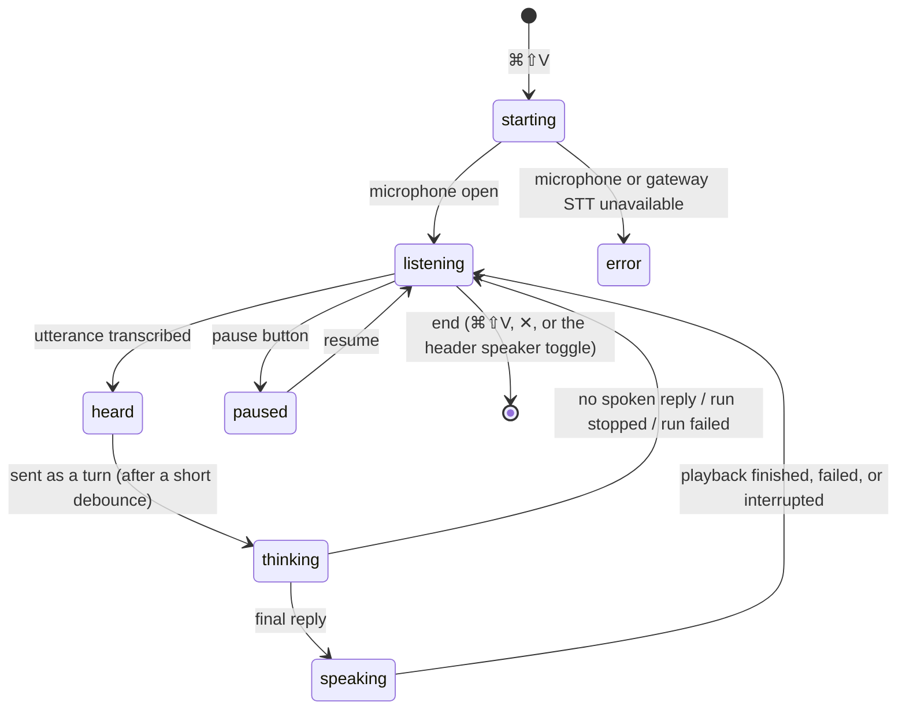

# Voice

Microphone capture and audio playback happen on your Mac; speech-to-text and text-to-speech run
on the gateway. The assistant offers three voice features, all of which require the `voice` extra
for microphone capture (`pip install "abstractassistant[voice]"`) and a gateway that advertises
the matching voice routes.

See [settings.md](settings.md) for the Voice page and [troubleshooting.md](troubleshooting.md)
for failures.

## Speak a reply

Every assistant reply has a speaker button. Click it to hear the reply; click again to pause and
resume. Switch on **Speak replies automatically** (header toggle or Voice settings) to have every
final answer spoken. Replies stream from the gateway's streaming TTS lane, so long answers start
playing within about a second; when the stream is unavailable the assistant says that it is
synthesizing the whole message first.

Spoken text is prose: markdown, code, images and link targets are removed before synthesis. A
reply with nothing left to read says so instead of playing nothing.

## Dictate into the message

The microphone button in the composer dictates into the message box. Each utterance is appended
to the text; press Return to send. Saying "stop" closes the microphone.

## Voice conversation (hands-free)

Start with ⌘⇧V, the waveform button next to the send button, or the tray menu. The loop:

What you see: a strip above the composer with a glyph, a live level meter, the state text
("Listening…", "Heard: …", "Thinking… (mic paused)", "Speaking…"), pause/resume, stop-speaking
and interrupt buttons, and an end button. The header title mirrors the state.

Behavior details:

- **Auto-send** (default on): each utterance becomes a turn after a short pause; closely spaced
  utterances are merged. With auto-send off, words land in the message box and Return sends them.
- **While the assistant works**, speech is not transcribed (the microphone is paused) so side
  conversation never steers the run. Speech that arrives between the reply and the next listen is
  kept for the next turn.
- **Spoken-style replies** (default on): each request carries an instruction to answer briefly, in
  natural spoken language, without markdown. The workflow's own system prompt is kept in front of
  it.
- **Stopping a reply** (Esc, the strip's stop button, or a spoken "stop" in barge-in mode)
  returns the loop to listening. Words heard while the previous run is still closing wait for
  the next listening window; they are never injected into the closing run.
- **Barge-in** depends on the Voice setting. "Pause the mic while the assistant speaks" (default,
  for speakers) never transcribes the assistant's own voice, so the reply cannot be interrupted by
  speaking; use Esc, the stop button, or the strip. "Keep the mic open" (for headphones) lets a
  spoken "stop" interrupt the reply.
- **Questions and approvals** pause the microphone while their window is open and resume it after
  your decision.
- **Typing still works** during a conversation; a typed send behaves like a spoken one.
- Auto-speak is on for the duration of the conversation and returns to your saved preference when
  it ends.

Failures name their cause in the strip and in a banner: a microphone that cannot start (macOS:
System Settings → Privacy & Security → Microphone), gateway speech input that is unavailable, a
reply that could not be spoken (the loop resumes listening), or a run that failed.

## Audio output

Playback follows the Mac's current default output device, resolved each time a reply is spoken,
so switching to headphones or another speaker in macOS takes effect on the next reply. You can
instead pin a device under Settings → Voice → Output device (see [settings.md](settings.md)).
When a pinned device is not connected, replies play on the system default and a notice says so.
When speech starts, a notice names the device and warns when the system output is muted or very
low. If the output device stops accepting audio mid-reply, playback is stopped and reported, and
the next reply reopens the device. While the microphone is live, the device list is not
refreshed, so a device change cannot interrupt capture.
